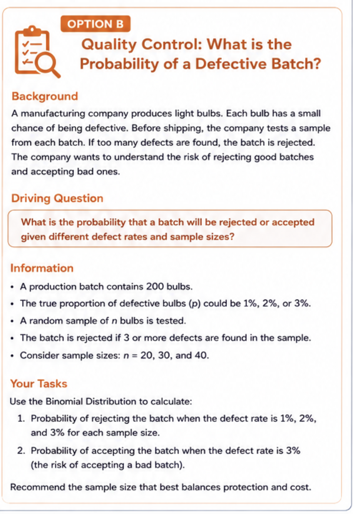

::: {.columns}

::: {.column}

:::

::: {.column}

## DEPENDING ON DEFECT RATE AND DISCARD THRESHOLD, HOW CAN A MANUFACTURER BALANCE RISK OF FALSE POSITIVES AND FALSE NEGATIVES IN THEIR QUALITY CONTROL PROCEDURE?

### Background

In the case of a lightbulb factory which institutes randomized sample testing from batches of bulbs produced, how can we determine the relative impact on overhead costs of different test parameters and defect rates? We will answer three questions:

#### 1. What is the probability of batch rejection given a defect rate?

#### 1. What is the probability of batch acceptance given a defect rate?

#### 1. Given open parameters, What is the impact on profit?

:::

:::

